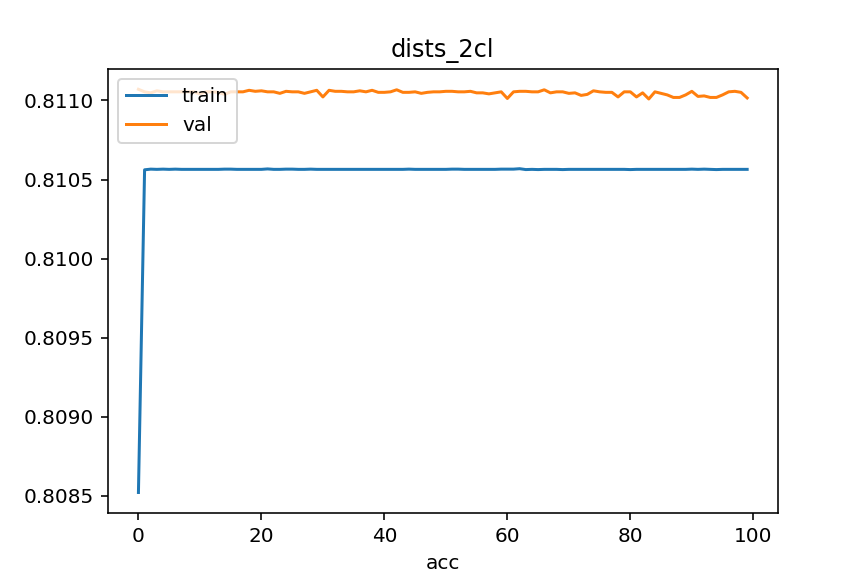
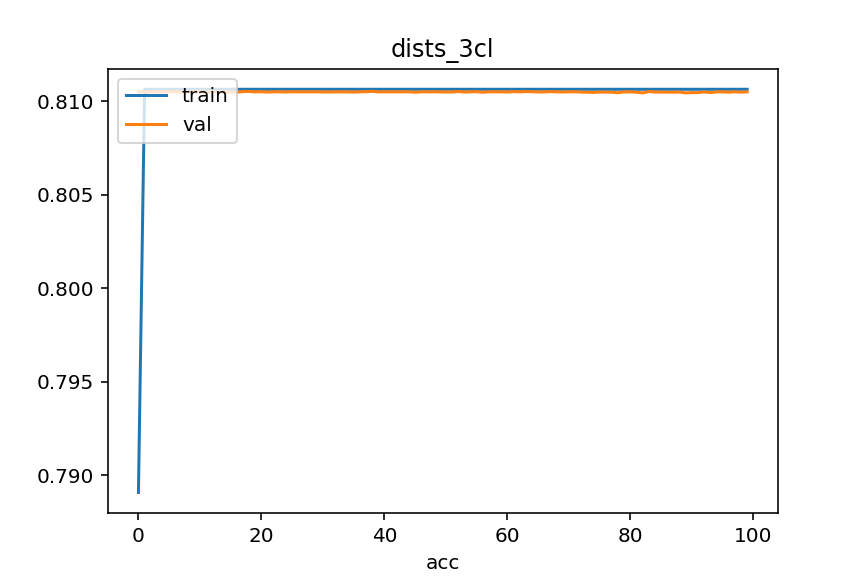
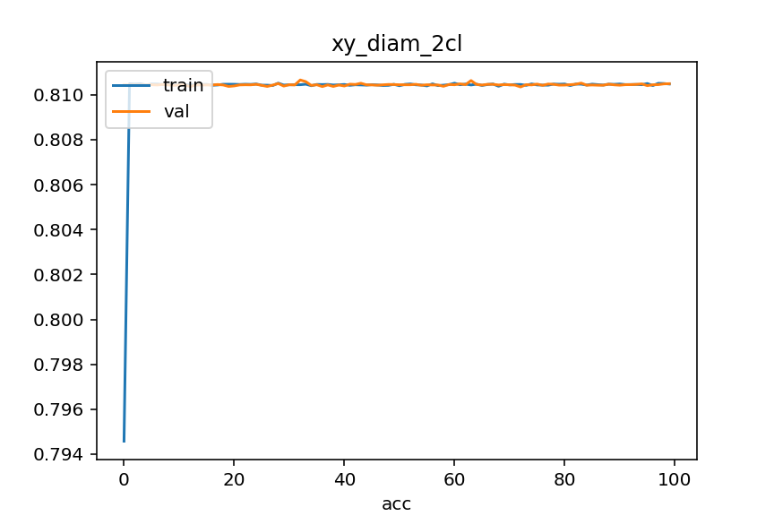
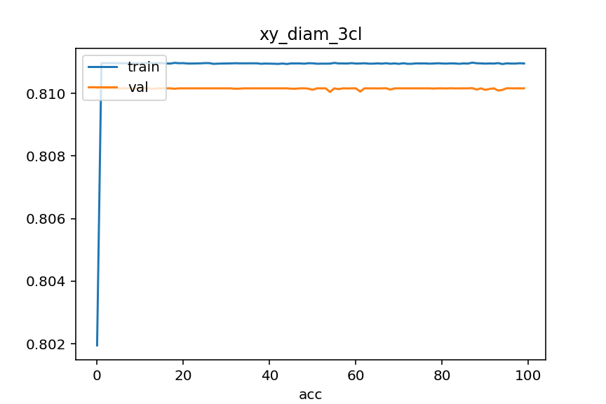
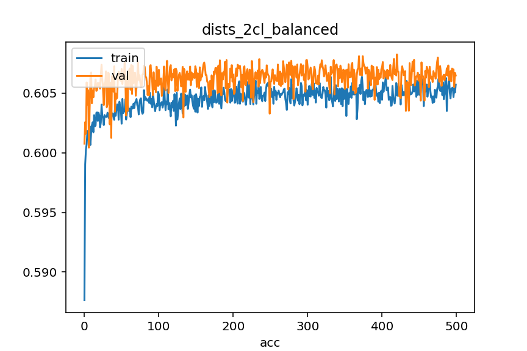
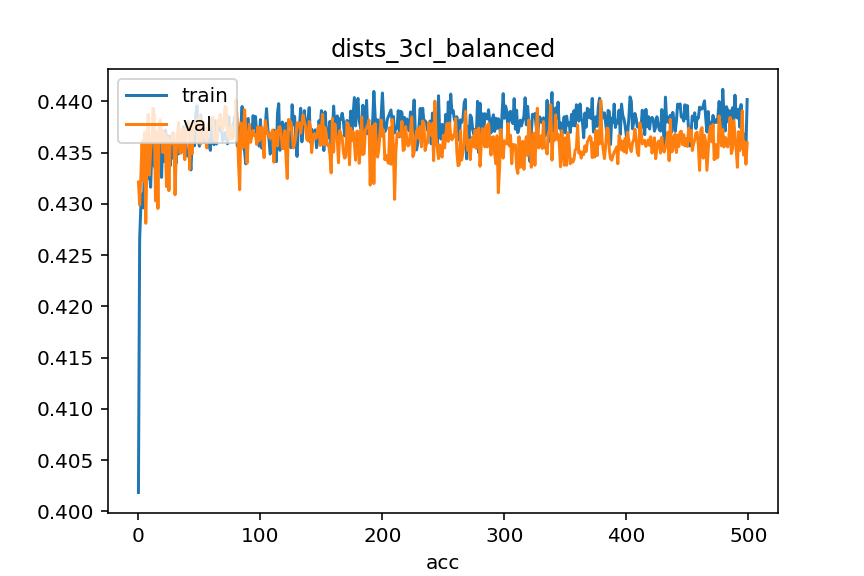
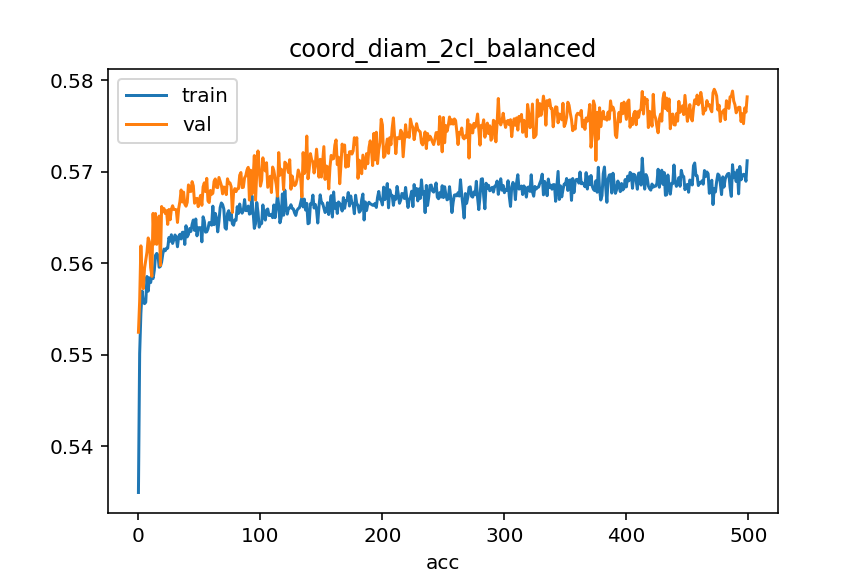
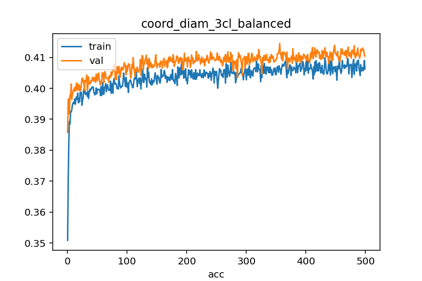

# NY-2015-Street-Tree-Data
## О проекте
В проекте был использован набор данных "NY-2015-Street-Tree-Data" (https://www.kaggle.com/datasets/new-york-city/ny-2015-street-tree-census-tree-data) для обучения модел нейронной сети с целью классификации состояния деревьев по трём классам - 'Good', 'Fair', 'Poor' и двум классам - 'Good', 'Fair' + 'Poor'.

## Основные этапы проекта
 - Анализ, очистка и подготовка датасета для дальнейшего использования для обучения модели ([notebook](./notebook/data_proc.ipynb)). На этом этапе основное внимание уделялось выделению признаков, пригодных для использования в алгоритмах глубокого обучения;
 - Подготовка скрипта для загрузки данных для обучения ([dataset](./src/dataset.py));
 - Подготовка архитектуры модели ([model](./src/nnets.py));
 - Обучение модели на различных датасетах с последующим сохранением ([learning](./src/main_learning.py));
 - Функционал для предсказания модели ([infer_main](./src/infer_main.py), [infer_API](./src/infer_API.py))

## Краткое изложение проекта и выводы

### Датасет
 - Изначально датасет содержал данные о 683788 деревьях в нескольких районах Нью-Йорка, распределённые по 45-ти признакам, многие из которых сразу не представляли интереса для задачи и были отброшены, такие как, например, 'state' - название штата.
 - Особенностью данного датасета является преимущественное присутствие в нём категориальных данных, сильный дисбаланс классов и наличие многих разных деревьев с одинаковыми значениями признаков. 
 - После анализа и очистки датасета в нём остались данные о 646252 деревьях распределённые по 3-м количественным признакам, пригодным для обучения нейронной сети. Из них порядка 81% данных принадлежат к классу 'Good'. Поэтому было принято решение создать дополнительные датасеты. Одни содержат только два целевых класса ('Good' и 'Fair' + 'Poor') - предполагалось, что это позволит сгладить классовый дисбаланс. Вторые выбраны из основного датасета таким образом, чтобы классы были примерно сбалансированы. Для трёх классов данные распределены примерно (35%/33%/32%) и для двух классов (52%/48%). 
 - Также отметим, что из-за малого количества признаков также был создан датасет, в котором в качестве признаков выступают расстояния от данного дерева до тридцати его ближайших соседей. Предполагается, что вероятность найти деревья в похожем состоянии рядом с рассматриваемым выше.
 - Таким образом, для обучения будет использоваться несколько датасетов: датасет, содержащий координаты положения дерева на карте и диаметр ствола дерева, и датасет, содержащий расстояния от рассматриваемого дерева до ближайших соседей. В свою очередь каждый из двух описанных датасетов будет использоваться в разных вариантах - для основной и сбалансированной выборок, а, также, для случаев двух или трёх целевых классов. Т.о. общее количество датасетов равно восьми.

### Модель
 - Так как данные представлены в табличной форме, то была выбрана самая простая архитектура полносвязной нейронной сети. Применять более сложные архитектуры (CNN, RNN и т.д.) не виделось возможным. Так же были включены слои пакетной нормализации и прореживания. 
 - Обучение проводилось на всех восьми датасетах, результаты сохранены в директории [models](./models)

### Метрики
 - Для валидации были использованы метрики accuracy и, в качестве эксперимента, precision, recall и f1_score. 

### Результаты и выводы
 - На всех несбаласированных датасетах, как в случае двух целевых классов, так и в случае трёх, сеть показала одинаковые результаты - точность около 81%. Однако, этот результат не является сколько-нибудь положительным по двум причинам: во-первых, эта точность совпадает с количеством меток класса 'Good' в несбалансированных выборках; во-вторых, метрика accuracy плохо работает для сильно несбалансированных выборок - модели достаточно каждый раз указывать метку преобладающего класса и значения метрики будут высоки. Здесь сработали оба этих фактора - на несбалансированных датасетах как в случае двух целевых классов, так и в случае трёх, модель всё время предсказывали значение, соответствующее классу 'Good'. Ниже приведены примеры графиков для метрики для несбалансированных датасетов

  

  

 - На сбалансированных датасетах сеть показала результаты несколько лучше, чем случайное угадывание: accuracy показало около 60% для датасета с расстояниями и около 57.5% для датасета с координатами и диаметрами для двух классов (около 52% постоянное предсказывание класса 'Good'), и 43.5% для датасета с расстояниями и около 41% для датасета с координатами и диаметрами для трёх классов (около 35% постоянное предсказывание класса 'Good'). Небольшой прирост точности связан со сбалансированность этих датасетов по классам. Ниже приведены примеры графиков для метрики для сбалансированных датасетов

  

  
 
 - Варьирование количества слоёв и нейронов слоях, а, также, использование разных функций активации не сказывается на улучшении качества модели.
 - Для эксперимента были использованы метрики precision, recall и f1_score, которые хорошо работают в таких случаях, однако их значения оказались на уровне 60%, что также является отрицательным результатом. Дальнейшее их использование на данном этапе выглядит нецелесообразным.
 
 - Для дальнейшего улучшения качества модели необходимо улучшать датасет. Во-первых попытаться сбалансировать его. На это указывает существенное улучшение качества модели по сравнению с её предсказаниями после обучения на несбалансированных датасетах. Во-вторых, увеличить количество и качество признаков. На первое может указывать то, что точность модели немного выше на датасете, содержащем расстояния в качестве признаков, существенно увеличивая т.о. их количество. На второе указывает, то что в самом датасете значения многих признаков одиноковые для разных деревьев и, более того, для разных классов. Также в датасете присутствуют признаки, которые вызывают сомнение во влиянии на состояние дерева, например, наличие на ветке висящих кроссовок.
 - Также рекомендуется параллельно поэкспериментировать с методами классического машинного обучения, напрмиер, с логистической регрессией для сравнения результатов с методами глубокого обучения для последующего вывода о целесообразности применения того или иного подхода.

### Использование
Проект предполагает несколько режимов использования:
 - Обучение сети. Запускается скриптом [learning](./src/main_learning.py) из IDE или командной строки.
Все параметры, необходимые для начала процесса обучения находятся в yaml-файле [parameters_learning](./src/paramters/parameters_learning.yaml), путь к которому считывается автоматически. Однако пользователь может изменить путь при помощи флага командной строки --par_dir. Содержимое файла с параметрами:
    - path_data_model - список путей к данным и директории, где должны находиться модели;
    - mode - выбор режима, в данном случае 'train';
    - batch_size - размер батчей;
    - output_size - количесво выходом модели (количество классов);
    - device - устройство, на котором будет проходить обучение;
    - EPOCHS - количество эпох обучения.

 - Предсказание обученной сети. Здесь реализованы две возможности:
    - Непосредственный запуск из директории проекта скрипта [infer_main](./src/infer_main.py). В это случае реализовано две возможности - выполнять предсказания по данным из тестового набора, либо по пользовательским дланным. Для этого в файле параметров, имеющем структуру
       - path_data_model - список путей к данным и директории, где должны находиться модели; 
       - mode - выбор режима, в данном случае 'test' или 'predict';
       - output_size: - количесво выходом модели (количество классов);
       - device: - устройство, на котором будет проходить обучение;
       - data_num - номер данных из тестового датасета, если mode='test'$
       - data - список значений, если mode='predict',
      необходимо указать соответствующие параметры и запустить скрипт в IDE или из командной строки.
    - Запуск на странице браузера при помощи FastAPI. Для этого необходимо запустить в командной строке скрипт [infer_API](./src/infer_API.py), затем скопировать полученный адрес и ввести его в браузере с добавлением /docs. На странице во вкладке predict ввести все необходимые данные.

