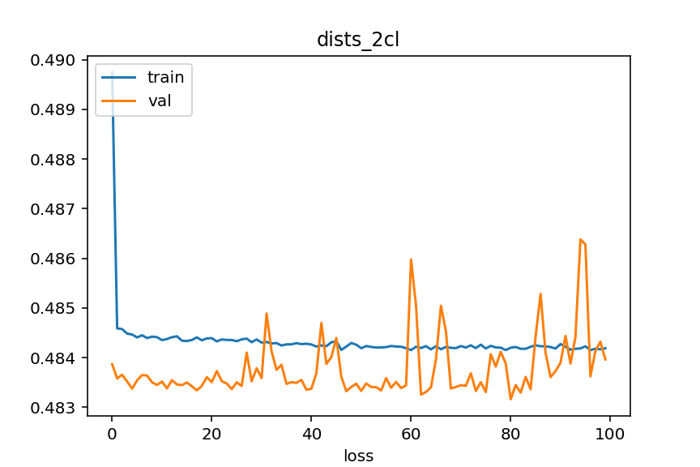

# NY-2015-Street-Tree-Data
## О проекте
В проекте был использован набор данных "NY-2015-Street-Tree-Data" (https://www.kaggle.com/datasets/new-york-city/ny-2015-street-tree-census-tree-data) для обучения модел нейронной сети с целью классификации состояния деревьев по трём классам - 'Good', 'Fair', 'Poor' и двум классам - 'Good', 'Fair' + 'Poor'.

## Основные этапы проекта
 - Анализ, очистка и подготовка датасета для дальнейшего использования для обучения модели ([notebook](./notebook/data_proc.ipynb)). На этом этапе основное внимание уделялось выделению признаков, пригодных для использования в алгоритмах глубокого обучения;
 - Подготовка скрипта для загрузки данных для обучения ([dataset](./src/dataset.py));
 - Подготовка архитектуры модели ([model](./src/nnets.py));
 - Обучение модели на различных датасетах с последующим сохранением ([learning](./src/main_learning.py));
 - Функционал для вывода модели

## Краткое изложение проекта и выводы

### Датасет
 - Изначально датасет содержал данные о 683788 деревьях в нескольких районах Нью-Йорка, распределённые по 45-ти признакам, многие из которых сразу не представляли интереса для задачи и были отброшены, такие как, например, 'state' - название штата.
 - Особенностью данного датасета является преимущественное присутствие в нём категориальных данных, сильный дисбаланс классов и наличие многих разных деревьев с одинаковыми значениями признаков. 
 - После анализа и очистки датасета в нём остались данные о 646252 деревьях распределённые по 3-м количественным признакам, пригодным для обучения нейронной сети. Из них порядка 81% данных принадлежат к классу 'Good'. Поэтому было принято решение создать дополнительные датасеты. Одни содержат только два целевых класса ('Good' и 'Fair' + 'Poor') - предполагалось, что это позволит сгладить классовый дисбаланс. Вторые выбраны из основного датасета таким образом, чтобы классы были примерно сбалансированы. Для трёх классов данные распределены примерно (35%/33%/32%) и для двух классов (52%/48%). 
 - Также отметим, что из-за малого количества признаков также был создан датасет, в котором в качестве признаков выступают расстояния от данного дерева до тридцати его ближайших соседей. Предполагается, что вероятность найти деревья в похожем состоянии рядом с рассматриваемым выше.
 - Таким образом, для обучения будет использоваться несколько датасетов: датасет, содержащий координаты положения дерева на карте и диаметр ствола дерева, и датасет, содержащий расстояния от рассматриваемого дерева до ближайших соседей. В свою очередь каждый из двух описанных датасетов будет использоваться в разных вариантах - для основной и сбалансированной выборок, а, также, для случаев двух или трёх целевых классов. Т.о. общее количество датасетов равно восьми.

### Модель
 - Так как данные представлены в табличной форме, то была выбрана самая простая архитектура полносвязной нейронной сети. Применять более сложные архитектуры (CNN, RNN и т.д.) не виделось возможным. Так же были включены слои пакетной нормализации и прореживания. 
 - Обучение проводилось на всех восьми датасетах, результаты сохранены в директории [models](./models)

### Метрики
 - Для валидации были использованы метрики accuracy и, в качестве эксперимента, precision, recall и f1_score. 

### Результаты и выводы
 - На всех несбаласированных датасетах, как в случае двух целевых классов, так и в случае трёх, сеть показала одинаковые результаты - точность около 81%. Однако, этот результат не является сколько-нибудь положительным по двум причинам: во-первых, эта точность совпадает с количеством меток класса 'Good' в несбалансированных выборках; во-вторых, метрика accuracy плохо работает для сильно несбалансированных выборок - модели достаточно каждый раз указывать метку преобладающего класса и значения метрики будут высоки. Здесь сработали оба этих фактора - на несбалансированных датасетах как в случае двух целевых классов, так и в случае трёх, модель всё время предсказывали значение, соответствующее классу 'Good'.

  

 - Для эксперимента были использованы метрики precision, recall и f1_score, которые хорошо работают в таких случаях, однако их значения оказались на уровне 60%, что также является отрицательным результатом.
 - 

     

### Использование и примеры
 - 

